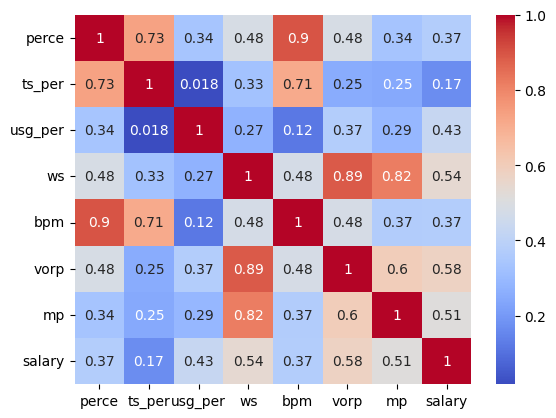
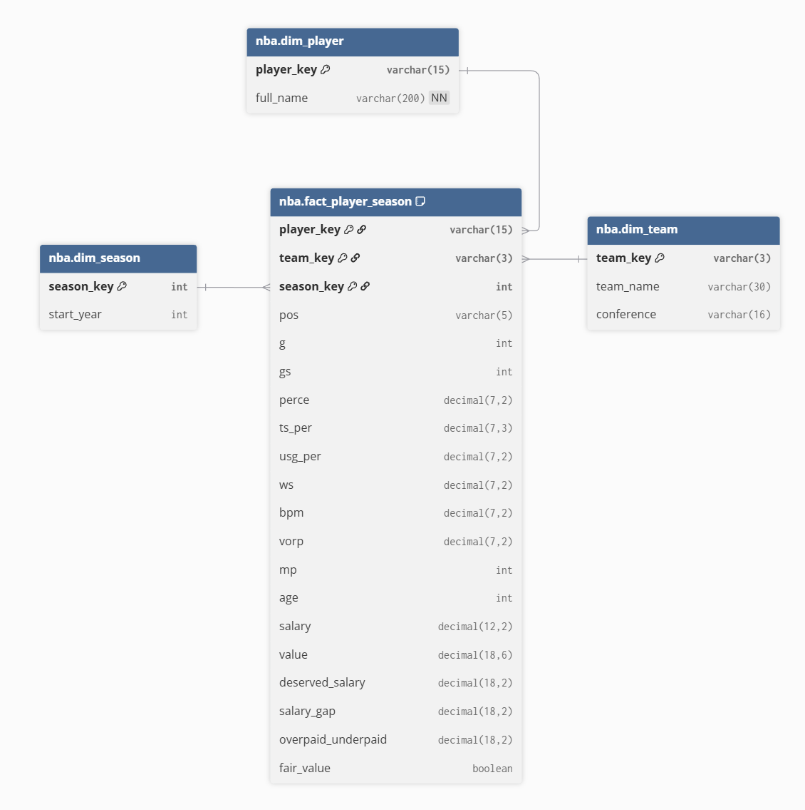
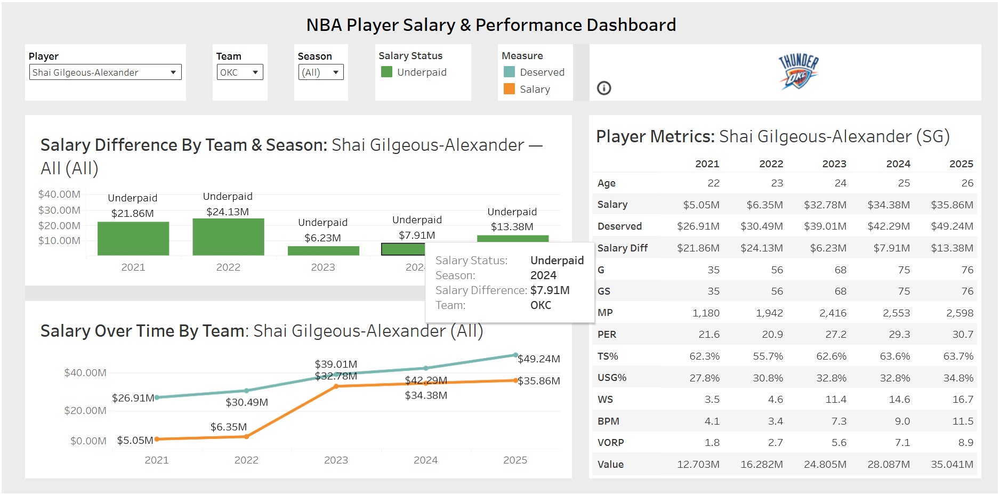
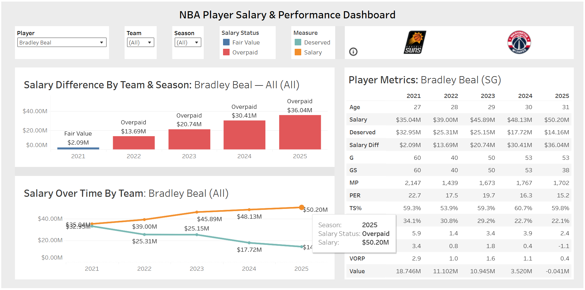
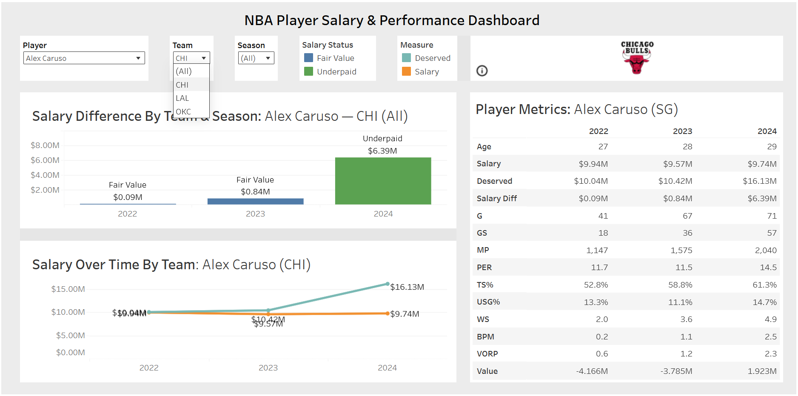

# NBA Player Value Warehouse Pipeline
## Project Overview 

This project quantifies NBA player salaries and their actual on court performance to assess "fair value" based on advanced statistics and historical salary data of the last 5 NBA seasons (2020-21 to 2024-25). By combining performance metrics with regression analysis, the goal of this project is to demonstrate a full data engineering workflow to enhance decision making processes through a data driven valuation tool that evaluates a player's value, supports salary projections, and provides interactive visual insights.

## Data Sources

- Historical statistics of the last 5 NBA seasons sourced from Basketball Reference ([2020-21](https://www.basketball-reference.com/leagues/NBA_2021_advanced.html), [2021-22](https://www.basketball-reference.com/leagues/NBA_2022_advanced.html), [2022-23](https://www.basketball-reference.com/leagues/NBA_2023_advanced.html), [2023-24](https://www.basketball-reference.com/leagues/NBA_2024_advanced.html), [2024-25](https://www.basketball-reference.com/leagues/NBA_2025_advanced.html))
- Salary data sourced from [Kaggle](https://www.kaggle.com/datasets/ratin21/nba-player-salaries-2000-2025)

## Methodology 

1. **Metric Selection**
    - The following metrics were chosen:
        - MP (Minutes Played)
        - PER (Player Efficiency Rating)
        - TS% (True Shooting Percentage)
        - USG% (Usage Percentage)
        - WS (Win Shares)
        - BPM (Box Plus Minus)
        - VORP (Value Over Replacement Player)
    - These advanced metrics are widely recognized as useful in modern NBA analytics to capture overall impact much better than traditional box score stats. 
    1. **Correlated Heatmap**
        - The correlated heatmap visualizes which metrics have the strongest relationship with each other. We are specifically looking at the salary row/column to find which advanced metrics have stronger correlation with salary and use that to weigh particular metrics more than others in the modeling method.

        

2. **Modeling Method**
    - We implemented a linear regression model to predict a player's "fair salary" based on the selected metrics. With these metrics as the features and actual player salary as the target, the model outputs a predicted "deserved" salary for each player, which is then used to compute a salary gap and classify fairness. 
    1. **Fair Value Rule**

        - The following equation was used to classify player salaries:
        ```gap_pct = (Actual Salary – Predicted Salary) / Predicted Salary```
        - This provided a certain percent to which we considered any percent in between and including -15% and 15% as "fair value". Any gap percent less than -15% was classified as underpaid and any gap percent greater than was classified as overpaid. 

3. **ETL Pipeline Overview**
    - The ETL process was necessary to clean up inconsistencies in column names, mismatching team and player spellings, missing values, duplicated rows (from players being traded midseason), and different season years outside of the previous 5 year interval before loading anything into Amazon Redshift.
    - Raw CSV files were uploaded to Amazon S3 to which Apache NiFi ingested the data and cleaned the inconsistencies through standardization, along with the help of Python for complex joins. 
    - Data was then loaded from cleaned and validated CSVs to Amazon Redshift following a star schema with a fact table and dimension tables, ensuring analysis ready data for the Tableau dashboard. 

4. **Warehouse Schema**
    - Our data warehouse follows a star schema design centered around the fact_player_season table, which stores each player's team and season, advanced metrics, salary, and surrogate keys.

     
    - This fact table is supported by three dimension tables: dim_player, dim_team, and dim_season. 
        - dim_player contains standardized player identifiers and cleaned names. 
        - dim_team maps team abbreviations and conference attributes. 
        - dim_season stores start and end years for each NBA season.
    - Together these dimensions allow Redshift to execute fast joins and aggregations while keeping the schema simple and optimized for analytical workloads.

## Results & Dashboard
- The final Tableau dashboard visualizes player value, performance metrics, fairness salary estimates, and season by season trends. Users can filter by player, team, or season to compare actual salary versus model predicted value and explore advanced metrics interactively.








## Key Insights / Takeaways
- Players with consistently high impact metrics, such as Alex Caruso, were able to stand out in deserved salary, even when their statistics gave them a low score ("Value" column measure).
- Contracts do not always align with these metrics due to reputation, team context, draft status, and/or inconsistent evaluation methods. A multi season analytical pipeline makes it possible to quantify these inconsistencies.
- Rookie scale contract players who posted solid to strong advanced metrics were major value drivers, especially for teams like the Thunder and Grizzlies that stacked multiple underpaid contributors.
- The regression model reliably explains salary variation and highlights outliers whose performance far exceeds or falls below their pay grade based on comparisons from actual salary and deserved salary to observe the salary difference.

## **Lessons Learned**
- **Analytics Pipeline:** This project strengthened our abilities to build a fully functional analytics pipeline, integrating ETL design with a data warehouse. 
- **Data Quality:** Building the full ETL pipeline showed that small inconsistencies in naming or schema can cascade and break downstream processes while modeling demonstrated the importance of clean, standardized metrics for stable regression results. 
- **Business Insights:** Through the modeling process, we learned how analytical insights can directly inform financial and roster decisions in basketball. 
- **NBA Metrics:** Exploring advanced metrics and correlation patterns expanded our knowledge of NBA data and how different statistics relate to player value.

## **Tech Stack**
- Amazon S3
- Amazon Redshift
- Apache NiFi
- Python 
- Tableau

## **Contributors**
- Andrew Chau
- Rish Jain
- Raniel Quesada
- Keon Sadeghi
- Utkarsh Sharma
